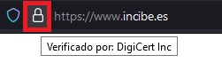

# Recomendaciones de seguridad

El siguiente documento trata de recoger una serie de recomendaciones a tener en cuenta desde el punto de vista de seguridad para evitar estafas, robo de identidades digitales (Facebook, Instagram, Twitter,...),...

Esta orientado a una **audiencia NO técnica**.

Recuerda, **si algo es gratis el producto eres tu!**

Mi agradecimiento a Nuria ()  y Marc ) por su labor de difusión en temas de seguridad y por acercarnos de forma sencilla términos y técnicas complejas con las que lidiamos cotidianamente aunque no lo sepamos o queramos.

## Recomendaciones

- **No te fíes**. Nadie da duros a cuatro pesetas, si un príncipe nigeriano te pide algo desconfía, si una rusa te quiere conocer desconfía, si alguien te ofrece una inversión y hacer dinero a espuertas desconfía. Son timos como el toco-mocho pero actualizados. **Quieren tu dinero!**
- **Usa varias cuentas de correo**. Una puede ser personal y otra para subscripciones o darte de alta en sitios.
- **Activa 2FA o MFA**. El objetivo del doble factor de autenticación es que **NO SOLO** nos autentiquemos con un usuario y contraseña, sino que una vez introducidos nos pidan un código adicional que se puede enviar via sms (lo mas sencillo) o haciendo uso de aplicaciones que generan dicho código. [Ejemplos de como activar 2FA](#mfa-2fa)
- **Usa un gestor de passwords**. Para evitar usar contraseñas repetidas o débiles. [Ejemplos de gestores de passwords.](#gestor-de-passwords)
- **Nunca des tu clave del banco a nadie** e incluso diciendo que son de tu banco y den muchos datos personales tuyos.
- **No pinches en enlaces (no solicitados)** que te llegan por correo, mensajes de redes sociales (whatsapp, telegram, instagram,..).
- **No contestes a teléfonos que no conozcas** (salvo cuando estas en la montaña!). [Link](https://mobile.twitter.com/cibernicola_es/status/1456360233618522120?t=jVr7HFF2MpG7O6YPM5COoA&s=03) de Marc 
- **Mira la barra del navegador cuando te conectes a sitios**. Los navegadores actuales verifican los certificados digitales de los sitios web. La conexión debe ser segura HTTPS, esto se ve porque tiene un candado en la barra de navegacion. **OJO MUY IMPORTANTE**, que tenga candado no quiere decir que el sitio sea legitimo!
- **Usa tarjetas virtuales**. Los bancos actuales permite disponer de tarjetas virtuales. Las tarjetas virtuales son tarjetas de un solo uso y por un importe, de forma que en caso de estafa no se tienen datos reales. [Ejemplos de tarjetas virtuales de bancos.](#tarjetas-virtuales)

## Glosario

- **Phishing. Suplantación de identidad**.

  Phishing es un [término informático](https://es.wikipedia.org/wiki/Anexo:Jerga_informática) que distingue a un conjunto de técnicas que persiguen el engaño a una  víctima ganándose su confianza haciéndose pasar por una persona, empresa o servicio de confianza (suplantación de identidad de tercero de  confianza), para manipularla y hacer que realice acciones que no debería realizar (por ejemplo revelar información confidencial o hacer click en un enlace)

- **MFA y 2FA**

  > La **autenticación de múltiples factores** (**AMF**) es un método de [control de acceso informático](https://es.wikipedia.org/wiki/Control_de_acceso_informático) en el que a un [usuario](https://es.wikipedia.org/wiki/Usuario_(informática)) se le concede acceso al sistema solo después de que presente dos o más  pruebas diferentes de que es quien dice ser. Estas pruebas pueden ser  diversas, como una contraseña, que posea una clave secundaria rotativa, o un certificado digital instalado en el equipo, entre otros.

  > La **autenticación de dos factores** (**A2F**), también usada la sigla inglesa **2FA** (de *two-factor authentication*), es un método que confirma que un usuario es quien dice ser combinando dos componentes diferentes de entre: 
  >
  > 1. algo que saben
  > 2. algo que  tienen
  > 3. algo que son. 
  >
  > Es el método más extendido en la actualidad  para acceder a cuentas de correo como las de iCloud o Gmail, pero  generalmente se solicita que el usuario active voluntariamente esta capa de protección adicional.

  > Un ejemplo de la vida cotidiana de este tipo de autenticación es  la retirada de efectivo de un cajero automático. Solo tras combinar una  tarjeta de crédito —algo que el usuario posee— y un pin —algo que el  usuario sabe— se permite que la transacción se lleve a cabo.

## Referencias

- [Instituto Nacional de Ciberseguridad](https://www.incibe.es/)
- [Oficina de seguridad del Internauta](https://www.osi.es/es)
- [Zibersegurtasun Euskal Zentroa](https://www.basquecybersecurity.eus/eu/index.html)

### MFA 2FA 

- https://es.wikipedia.org/wiki/Autenticaci%C3%B3n_de_m%C3%BAltiples_factores

- https://www.computerweekly.com/es/definicion/Autenticacion-multifactor-o-MFA
- https://www.xatakandroid.com/seguridad/aplicaciones-autenticacion-dos-pasos-que-como-funcionan-mejores-opciones

**Habilitar 2FA**

- [Twitter](https://help.twitter.com/es/managing-your-account/two-factor-authentication)

- [Instagram](https://help.instagram.com/1124604297705184)
- [Facebook](https://m.facebook.com/help/148233965247823?locale2=es_ES )
- [TikTok](https://www.tiktok.com/safety/youth-portal/keep-your-account-secure?lang=es)
- [Linkedin](https://www.linkedin.com/help/linkedin/answer/31700/activar-y-desactivar-la-verificacion-en-dos-etapas?lang=es)
- [EPIC Games - Fortnite](https://www.epicgames.com/fortnite/es-MX/news/2fa )

### Gestor de passwords

- https://www.xataka.com/basics/gestores-contrasenas-que-cuales-populares-como-utilizarlos

- https://www.xatakandroid.com/listas/los-mejores-gestores-de-contrasenas-para-android-comparativa-a-fondo

**Tiempo para hackear una contraseña**

https://www.hivesystems.io/blog/are-your-passwords-in-the-green?utm_source=header

### Certificados de sitios

**OJO, MUY IMPORTANTE:** Que un sitio tenga candado no quiere decir que el sitio sea legitimo.

La comunicación con los sitios web debe de ser siempre segura (https) y debe estar protegido por un certificado digital (candado). 

### Tarjetas virtuales

- [Abanca](https://www.abanca.com/es/tarjetas/tarjetas-debito/tarjetas-prepago/)

- [BBVA](https://www.bbva.es/personas/productos/tarjetas/tarjeta-virtual.html)

- [Caja Sur](https://clientes.cajasur.es/cuentas-tarjetas/tarjeta-virtual.html)

- [Caixa Bank](https://www.caixabank.es/particular/tarjetas/tarjeta-virtual-caixabankwallet.html#)

- [Kutxabank](https://clientes.kutxabank.es/es/cuentas-tarjetas/tarjeta-virtual.html)

- [ING](https://www.ing.es/twyp#)

- [Openbank](https://www.openbank.es/en/virtual-card-free-debit-card)

- [Sabadell](https://www.bancsabadell.com/cs/Satellite/SabAtl/bs/1191347804050/es/segmento%253DEmpresas%2526prefijoruta%253Dtxempbs%252F%2526contentId%253D1191347804050%2526mapa%253Dtrue%2526nivel%253D1)

- [Santander](https://www.bancosantander.es/particulares/cuentas-tarjetas/tarjetas/debito/virtual-e-cash)

  

