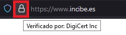

# Recomendaciones de seguridad
[Castellano](./README.md) | [Catalan](./README_ca.md) | [Euskera](./README_eu.md) |  [Gallego](./README_gl.md) 

O seguinte documento ten o obxectivo de recoller unha serie de recomendacións a ter en conta dende unha perspectiva de seguridade 
para evitar estafas, roubos de identidades dixitais(Facebook, Instagram, Twitter,...) 
Está orientado a unha **audiencia NON técnica**.

Recorda, **se algo é gratis o producto eres ti!**

Meus agradecementos a Nuria  
e Marc 
pola súa labor de difusión en temas de seguridade e por acercarnos de forma sinxela termos e técnicas complexas coas que pelexamos cotiánamente ainda que non o sepamos ou queramos.

## Recomendacións 

- **Non te fíes**. Ninguén da duros a catro pesetas, se un príncipe nixeriano pidete algo desconfía, se unha rusa quere coñecerte desconfía, 
se alguén ofrécete unha inversión e facer cartos a esportas desconfía. Son timos coma o do “tocomocho” pero actualizados.
**Queren os teus cartos!** Os teus datos para obter o teu diñeiro.

- **Usa varias contas de correo**. A dirección de correo que tes asociada ao teu banco nunca a uses para outras comunicacións. Logo podes ter 
tantas como o consideres necesario, clasificaás por importancia. ¿Sabes que existen sitios que te asignan unha conta de correo temporalmente?
Proba a buscar en Google: email temporal

- **Activa 2FA o MFA**. O obxectivo do dobre factor de autenticación é que NON SÓ nos autenticamos cun usuario e contrasinal, senón que unha 
vez introducidos pídannos un código adicional que pódese enviar via sms (o máis sinxelo)  facendo uso das aplicaciones que xeran ditoo código.
[Exemplos de como activar 2FA](#mfa-2fa)

- **Usa un xestor de “passwords”**. Para evitar usar contrasinais repetidas ou débiles. OLLO! normalmente para acceder a estos xestores tes que 
establecer unha contrasinal e ésta si debe ser complicada. Se o xestor ten posibilidade de facer un “backup” na nube, descártao. Mellor facelo 
no teu ordenador ou podes subilo a calqueira nube pero "camúflao". [Exemplos de xestores de passwords.](#gestor-de-passwords)

- **Nunca deixes a  túa clave do banco a ninguén** e incluso dicindo que son do teu banco e dean moitos datos personais.

- **Non premas nos enlaces (non solicitados)** que te chegan por correo, mensaxes de redes sociais (whatsapp, telegram, instagram,..).

- **Non contestes aos teléfonos que non coñezas** (salvo cando estas na montaña!). [Link](https://mobile.twitter.com/cibernicola_es/status/1456360233618522120?t=jVr7HFF2MpG7O6YPM5COoA&s=03)
de Marc 

- **Mira a barra do navegador cando te conectes aos sitios**. Os navegadores actuais verifican os certificados dixitales dos sitios web. A conexión 
debe ser segura HTTPS, isto se ve porque teñen un candado na barra de navegación. OLLO MOI IMPORTANTE, que teña candado non quere decir que o sitio 
sea lexitimo!

- **Usa tarxetas virtuais**. Os bancos actuais permiten dispor de tarxetas virtuais. As tarxetas virtuais son tarxetas dun só uso e por un importe, 
de forma que en caso de estafa non se teñen datos reais. Exemplos de tarjetas virtuais de bancos.

- **Subir ficheiros e fotos á nube**. A mayoría das aplicacións de móvil permítenche subir fotos e ficheiros á nube. Pensa que toda esa información 
estásela dando ás empresas pero se tes un problema de seguridade, os ciberdelincuentes obtiveron túa clave, eles tamén tendrán acceso a elas.

- **Renova os accesos as tuas APPs**. Normalmente accedemos as RRSS e contas de correo mediante as aplicacións móvil. Os ciberdelincuentes poden 
obter a "chave" de acceso ( token ) e polo tanto podrán entrar a esos sitios. De vez en cando pecha as aplicacións e volve a entrar.

## Glosario
- **Phishing. Suplantación de identidade**.
  > Phishing é un termo informático que distingue a un conxunto de técnicas que perseguen o engano a unha vítima gañándose  a súa confianza 
 facéndose pasar por unha persoa, empresa ou servizo de confianza (suplantación de identidade de terceiro de confianza), para manipula e 
 facerla que realice accións que non debería realizar (por exemplo revelar información confidencial ou facer click nun enlace)
  > https://es.wikipedia.org/wiki/Phishing

- **MFA y 2FA**
  > A **autenticación de múltiples factores**  (**AMF**) é un método de [control de acceso informático](https://es.wikipedia.org/wiki/Control_de_acceso_informático)
 no que a un [usuario](https://es.wikipedia.org/wiki/Usuario_(informática)) se lle concede acceso ao sistema só despois de que presente dous ou máis probas 
 diferentes de que é quen di ser. Estas probas poden ser diversas, coma unha contrasinal, que posea unha clave secundaria rotativa, ou un certificado 
 dixital instalado no equipo, entre outros.

  > La *autenticación de dos factores* (**A2F**), tamén usada a sigla inglesa 2FA (de two-factor authentication), é un método que confirma que un usuario é 
 quen di ser combinando dous componentes diferentes de entre:

1. algo que saben
2. algo que teñen
3. algo que son.
> É o método máis extendido na actualidade para acceder a contas de correo coma as de iCloud ou Gmail, pero xeralmente se solicita que o usuario active
voluntariamente esta capa de protección adicional. Un exemplo da vida cotidiana de este tipo de autenticación é a retirada de efectivo dun caxeiro automático.
Só tras combinar unha tarxeta de crédito —algo que o usuario posee— e un pin —algo que o usuario sabe— se permite que a transacción se leve a cabo.

 >
 > https://es.wikipedia.org/wiki/Autenticaci%C3%B3n_de_m%C3%BAltiples_factores

## Referencias

- [Instituto Nacional de Ciberseguridad](https://www.incibe.es/)
- [Oficina de seguridad del Internauta](https://www.osi.es/es)
- [Zibersegurtasun Euskal Zentroa](https://www.basquecybersecurity.eus/eu/index.html)

### MFA 2FA 

- https://es.wikipedia.org/wiki/Autenticaci%C3%B3n_de_m%C3%BAltiples_factores
- https://www.computerweekly.com/es/definicion/Autenticacion-multifactor-o-MFA
- https://www.xatakandroid.com/seguridad/aplicaciones-autenticacion-dos-pasos-que-como-funcionan-mejores-opciones

**Activar 2FA**

- [Twitter](https://help.twitter.com/es/managing-your-account/two-factor-authentication)
- [Instagram](https://help.instagram.com/1124604297705184)
- [Facebook](https://m.facebook.com/help/148233965247823?locale2=es_ES )
- [TikTok](https://www.tiktok.com/safety/youth-portal/keep-your-account-secure?lang=es)
- [Linkedin](https://www.linkedin.com/help/linkedin/answer/31700/activar-y-desactivar-la-verificacion-en-dos-etapas?lang=es)
- [EPIC Games - Fortnite](https://www.epicgames.com/fortnite/es-MX/news/2fa )

### Xestor de contrasinais 

- https://www.xataka.com/basics/gestores-contrasenas-que-cuales-populares-como-utilizarlos

- https://www.xatakandroid.com/listas/los-mejores-gestores-de-contrasenas-para-android-comparativa-a-fondo

**É hora de hackear un contrasinal**

https://www.hivesystems.io/blog/are-your-passwords-in-the-green?utm_source=header

### Certificados de sitios

**OLLO, MOI IMPORTANTE:** Que un sitio teña un cadeado non significa que o sitio sexa lexítimo.
A comunicación cos sitios web debe ser sempre segura (https) e debe estar protexida por un certificado dixital (cadeado). 

### Tarxetas virtuais 

- [Abanca](https://www.abanca.com/es/tarjetas/tarjetas-debito/tarjetas-prepago/)

- [BBVA](https://www.bbva.es/personas/productos/tarjetas/tarjeta-virtual.html)

- [Caja Sur](https://clientes.cajasur.es/cuentas-tarjetas/tarjeta-virtual.html)

- [Caixa Bank](https://www.caixabank.es/particular/tarjetas/tarjeta-virtual-caixabankwallet.html#)

- [Kutxabank](https://clientes.kutxabank.es/es/cuentas-tarjetas/tarjeta-virtual.html)

- [ING](https://www.ing.es/twyp#)

- [Openbank](https://www.openbank.es/en/virtual-card-free-debit-card)

- [Sabadell](https://www.bancsabadell.com/cs/Satellite/SabAtl/bs/1191347804050/es/segmento%253DEmpresas%2526prefijoruta%253Dtxempbs%252F%2526contentId%253D1191347804050%2526mapa%253Dtrue%2526nivel%253D1)

- [Santander](https://www.bancosantander.es/particulares/cuentas-tarjetas/tarjetas/debito/virtual-e-cash)
